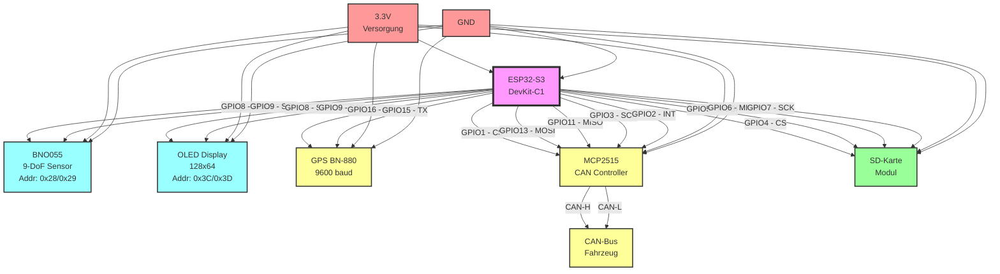

 # ESP32-S3 Straßenqualitäts-Messsystem - Hardware Schaltplan

## Übersicht
Dieses Dokument zeigt den vollständigen Schaltplan für das ESP32-S3 basierte Straßenqualitäts-Messsystem mit allen Komponenten und Verbindungen.

## Komponenten
- **ESP32-S3** DevKit-C1
- **BNO055** 9-DoF Sensor (I2C)
- **OLED Display** 128x64 (I2C)
- **GPS Modul** BN-880 (UART)
- **MCP2515** CAN-Bus Controller (SPI)
- **SD-Karte** Modul (SPI)

## Schaltplan

## Pin-Belegung Tabelle

### ESP32-S3 Pin-Zuordnung

| GPIO Pin | Funktion | Komponente | Beschreibung |
|----------|----------|------------|--------------|
| **I2C-Bus** |
| GPIO 8   | SDA      | BNO055 & OLED | I2C Datenleitung |
| GPIO 9   | SCL      | BNO055 & OLED | I2C Taktleitung |
| **UART (GPS)** |
| GPIO 16  | RX       | GPS BN-880 | UART Empfang (ESP32 ← GPS) |
| GPIO 15  | TX       | GPS BN-880 | UART Senden (ESP32 → GPS) |
| **SPI-Bus 1 (SD-Karte)** |
| GPIO 4   | CS       | SD-Karte | Chip Select |
| GPIO 5   | MOSI     | SD-Karte | Master Out Slave In |
| GPIO 6   | MISO     | SD-Karte | Master In Slave Out |
| GPIO 7   | SCK      | SD-Karte | Serial Clock |
| **SPI-Bus 2 (CAN)** |
| GPIO 1   | CS       | MCP2515 | Chip Select |
| GPIO 13  | MOSI     | MCP2515 | Master Out Slave In |
| GPIO 11  | MISO     | MCP2515 | Master In Slave Out |
| GPIO 3   | SCK      | MCP2515 | Serial Clock |
| GPIO 2   | INT      | MCP2515 | Interrupt-Leitung |

### Komponenten-Details

#### BNO055 (9-DoF Sensor)
- **Versorgung:** 3.3V
- **I2C-Adresse:** 0x28 (Standard) oder 0x29 (alternativ)
- **Pull-up Widerstände:** 4.7kΩ auf SDA und SCL (meist auf Modul vorhanden)

#### OLED Display (128x64)
- **Versorgung:** 3.3V
- **I2C-Adresse:** 0x3C (Standard) oder 0x3D (alternativ)
- **Controller:** SSD1306

#### GPS BN-880
- **Versorgung:** 3.3V
- **Baudrate:** 9600 bps
- **Protokoll:** NMEA 0183

#### MCP2515 CAN-Controller
- **Versorgung:** 3.3V
- **Oszillator:** 8MHz oder 16MHz (automatisch erkannt)
- **CAN-Baudrate:** 500 kbps
- **Transceiver:** TJA1050 oder MCP2551 (auf Modul)

#### SD-Karten Modul
- **Versorgung:** 3.3V
- **Dateisystem:** FAT32
- **SPI-Geschwindigkeit:** 400kHz (Init), dann höher

## Wichtige Hinweise

### Stromversorgung
- Alle Komponenten arbeiten mit 3.3V
- ESP32-S3 kann über USB mit 5V versorgt werden (interner Regler)
- Gesamtstromverbrauch: ~200mA typisch, ~350mA maximal

### Pull-up Widerstände
- I2C-Bus benötigt 4.7kΩ Pull-ups auf SDA und SCL
- Die meisten Module haben diese bereits integriert
- Bei mehreren I2C-Geräten nur einmal Pull-ups verwenden

### CAN-Bus Terminierung
- CAN-Bus benötigt 120Ω Terminierungswiderstände
- Einer am MCP2515-Modul, einer am anderen Ende des Busses

### SD-Karten Kompatibilität
- Verwenden Sie hochwertige SD-Karten (Class 10 oder besser)
- Format: FAT32, maximale Größe 32GB empfohlen

### GPS-Antenne
- BN-880 hat integrierte Keramik-Antenne
- Für beste Empfangsqualität mit freier Sicht zum Himmel montieren

## Verkabelungs-Checkliste

- [ ] ESP32-S3 mit USB-Kabel für Stromversorgung verbunden
- [ ] I2C-Bus (GPIO 8/9) mit BNO055 und OLED verbunden
- [ ] UART (GPIO 15/16) mit GPS-Modul verbunden
- [ ] SPI-Bus 1 (GPIO 4/5/6/7) mit SD-Karten-Modul verbunden
- [ ] SPI-Bus 2 (GPIO 1/3/11/13) mit MCP2515 verbunden
- [ ] GPIO 2 mit MCP2515 INT-Pin verbunden
- [ ] CAN-H/CAN-L mit Fahrzeug-CAN-Bus verbunden
- [ ] Alle GND-Verbindungen hergestellt
- [ ] Alle 3.3V-Verbindungen hergestellt