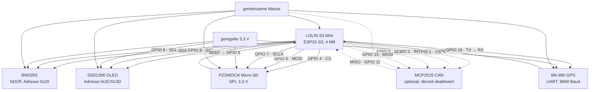

# ROADTEST – logischer Verdrahtungsplan

Dieses Dokument zeigt die Signalverbindungen des vorhandenen
Lochrasteraufbaus. Es ist kein maßstäblicher Bestückungsplan und bildet keine
einzelnen Lochraster-Lötpunkte oder Kabelfarben ab. Die ausführlichen
elektrischen Hinweise stehen in [HARDWARE.md](HARDWARE.md).

## Aktiver Aufbau

```mermaid
flowchart TB
    MCU["LOLIN S3 Mini<br/>ESP32-S3, 4 MB"]
    BNO["BNO055<br/>NDOF, Adresse 0x29"]
    OLED["SSD1306 OLED<br/>Adresse 0x3C/0x3D"]
    GPS["BN-880 GPS<br/>UART, 9600 Baud"]
    SD["PZSMOCN Micro-SD<br/>SPI, 3,3 V"]
    CAN["MCP2515 CAN<br/>optional, derzeit deaktiviert"]
    V33["geregelte 3,3 V"]
    GND["gemeinsame Masse"]

    MCU -->|"GPIO 8 · SDA"| BNO
    MCU -->|"GPIO 9 · SCL"| BNO
    MCU -->|"GPIO 8 · SDA"| OLED
    MCU -->|"GPIO 9 · SCL"| OLED

    GPS -->|"TX → GPIO 16 · RX"| MCU
    MCU -->|"GPIO 15 · TX → RX"| GPS

    MCU -->|"GPIO 4 · CS"| SD
    MCU -->|"GPIO 5 · MOSI"| SD
    SD -->|"MISO → GPIO 6"| MCU
    MCU -->|"GPIO 7 · SCLK"| SD

    MCU -.->|"GPIO 1 · CS"| CAN
    MCU -.->|"GPIO 2 · INT"| CAN
    MCU -.->|"GPIO 3 · SCK"| CAN
    MCU -.->|"GPIO 13 · MOSI"| CAN
    CAN -.->|"MISO · GPIO 11"| MCU

    V33 --> BNO
    V33 --> OLED
    V33 --> GPS
    V33 --> SD

    GND --> MCU
    GND --> BNO
    GND --> OLED
    GND --> GPS
    GND --> SD
    GND -.-> CAN
```

Gestrichelte CAN-Verbindungen sind vorbereitet, aber in Firmware 1.5.10 nicht
aktiv. Die CAN-Modulversorgung ist erst nach Prüfung der konkreten
MCP2515/TJA1050-Ausführung anzuschließen.

## Pinliste

| GPIO | Signal | Ziel |
|---:|---|---|
| 1 | CAN CS | MCP2515, optional |
| 2 | CAN INT | MCP2515, optional |
| 3 | CAN SCK | MCP2515, optional |
| 4 | SD CS | PZSMOCN SD-Modul |
| 5 | SD MOSI | PZSMOCN SD-Modul |
| 6 | SD MISO | PZSMOCN SD-Modul |
| 7 | SD SCLK | PZSMOCN SD-Modul |
| 8 | I²C SDA | BNO055 und OLED |
| 9 | I²C SCL | BNO055 und OLED |
| 11 | CAN MISO | MCP2515, optional |
| 13 | CAN MOSI | MCP2515, optional |
| 15 | UART TX | BN-880 RX |
| 16 | UART RX | BN-880 TX |

## Nicht verwendete Signale

- BNO055: `3Vo`, `RST`, `PS0`, `PS1` und `INT`
- BN-880: `PPS`
- MCP2515/CAN: vollständig optional und derzeit deaktiviert

## Versorgung

- LOLIN S3 Mini: USB-C oder vorhandener LiPo-Akkuanschluss
- BNO055, OLED, BN-880 und PZSMOCN SD-Modul: geregelte 3,3 V
- Alle Baugruppen: gemeinsame Masse
- Keine 5-V-Signale an ESP32-S3-GPIOs
- CAN-Modul: Versorgung und SPI-Pegel vor dem Anschluss gesondert prüfen
