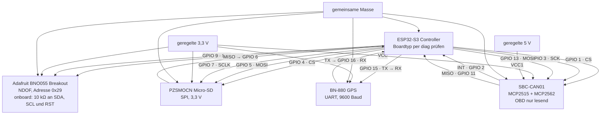

# ROADTEST – logischer Verdrahtungsplan

Dieses Dokument zeigt die Signalverbindungen des vorhandenen
Lochrasteraufbaus. Es ist kein maßstäblicher Bestückungsplan und bildet keine
einzelnen Lochraster-Lötpunkte oder Kabelfarben ab. Die ausführlichen
elektrischen Hinweise stehen in [HARDWARE.md](HARDWARE.md).

Dieselbe Verdrahtung liegt als geprüfter KiCad-Schaltplan unter
[`kicad/roadtest_ref/`](kicad/roadtest_ref/README.md). Er wird aus dieser
Pinliste erzeugt; seine Netzliste deckt sich Pin für Pin mit ihr.

> **Das SSD1306-OLED ist seit dem 03.08.2026 ausgebaut** und in diesem Plan
> nicht mehr enthalten. Der BNO055 ist damit der einzige I²C-Teilnehmer:
> Fällt er aus, lässt sich am Bus nicht mehr feststellen, ob Sensor oder Bus
> die Ursache ist. Wer das für eine Fehlersuche braucht, hängt vorübergehend
> ein beliebiges I²C-Gerät an — der Scanner findet es ohne Codeänderung.

## Aktiver Aufbau

```mermaid
flowchart TB
    MCU["ESP32-S3 Controller<br/>Boardtyp per diag prüfen"]
    BNO["Adafruit BNO055 Breakout<br/>NDOF, Adresse 0x29<br/>onboard: 10 kΩ an SDA, SCL und RST"]
    GPS["BN-880 GPS<br/>UART, 9600 Baud"]
    SD["PZSMOCN Micro-SD<br/>SPI, 3,3 V"]
    CAN["SBC-CAN01<br/>MCP2515 + MCP2562<br/>OBD nur lesend"]
    V33["geregelte 3,3 V"]
    V5["geregelte 5 V"]
    GND["gemeinsame Masse"]

    MCU -->|"GPIO 8 · SDA"| BNO
    MCU -->|"GPIO 9 · SCL"| BNO

    GPS -->|"TX → GPIO 16 · RX"| MCU
    MCU -->|"GPIO 15 · TX → RX"| GPS

    MCU -->|"GPIO 4 · CS"| SD
    MCU -->|"GPIO 5 · MOSI"| SD
    SD -->|"MISO → GPIO 6"| MCU
    MCU -->|"GPIO 7 · SCLK"| SD

    MCU -->|"GPIO 1 · CS"| CAN
    CAN -->|"INT · GPIO 2"| MCU
    MCU -->|"GPIO 3 · SCK"| CAN
    MCU -->|"GPIO 13 · MOSI"| CAN
    CAN -->|"MISO · GPIO 11"| MCU

    V33 --> BNO
    V33 --> GPS
    V33 --> SD
    V33 -->|"VCC"| CAN
    V5 -->|"VCC1"| CAN

    GND --> MCU
    GND --> BNO
    GND --> GPS
    GND --> SD
    GND --> CAN
```

Firmware 1.5.23 fragt über ISO 15765-4 CAN mit 11-Bit-Identifiern und
500 kbit/s ausschließlich OBD-Service-01-Livewerte ab. `P1` bleibt am
Fahrzeug offen; CAN-H geht an OBD-Pin 6, CAN-L an OBD-Pin 14.

## Pinliste

| GPIO | Signal | Ziel |
|---:|---|---|
| 1 | CAN CS | MCP2515 |
| 2 | CAN INT | MCP2515 |
| 3 | CAN SCK | MCP2515; ESP32-S3-Strapping-Pin |
| 4 | SD CS | PZSMOCN SD-Modul |
| 5 | SD MOSI | PZSMOCN SD-Modul |
| 6 | SD MISO | PZSMOCN SD-Modul |
| 7 | SD SCLK | PZSMOCN SD-Modul |
| 8 | I²C SDA | BNO055 |
| 9 | I²C SCL | BNO055 |
| 11 | CAN MISO | MCP2515 |
| 13 | CAN MOSI | MCP2515 |
| 15 | UART TX | BN-880 RX |
| 16 | UART RX | BN-880 TX |

## Nicht verwendete Signale

- BNO055: `3Vo`, `RST`, `PS0`, `PS1` und `INT`; `RST` wird durch den
  vorhandenen 10-kΩ-Pull-up des Breakouts high gehalten
- BN-880: `SCL` und `SDA` des fotografierten 6-poligen Anschlusses
- MCP2515/CAN: keine DTC-Löschung, Codierung oder Stellgliedansteuerung

## Versorgung

- ESP32-S3-Controller: USB-C oder vorhandener LiPo-Akkuanschluss
- BNO055, BN-880 und PZSMOCN SD-Modul: geregelte 3,3 V
- Alle Baugruppen: gemeinsame Masse
- Keine 5-V-Signale an ESP32-S3-GPIOs
- CAN-Modul: `VCC` 3,3 V, `VCC1` 5 V, gemeinsame Masse

## BNO055-Pull-ups

Das Adafruit-Breakout enthält je **10 kΩ von SDA und SCL nach 3Vo** sowie
**10 kΩ von RST nach 3Vo**. Der RST-Header bleibt extern offen. Am
vollständigen I²C-Bus wurden durch die parallelen Modulwiderstände effektiv
2,54 kΩ gegen 3,3 V gemessen. Deshalb werden keine zusätzlichen externen
SDA-/SCL-Pull-ups bestückt.

## BN-880-Anschluss

Das fotografierte BN-880 besitzt einen 6-poligen Anschluss. Benutzt werden
`VCC`, `GND`, `TX` und `RX`; die zusätzlichen Leitungen `SCL` und `SDA` für
die optionale Kompass-Schnittstelle bleiben frei. Maßgeblich sind die
Beschriftungen am Modul, nicht Kabelfarben oder eine generische
Steckernummerierung.
